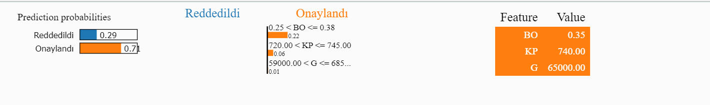
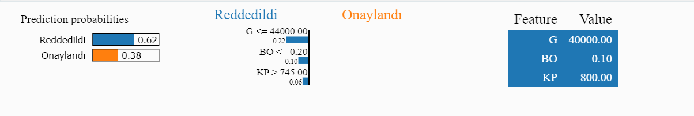

### Yapay Zeka ve XAI (Explainable Artificial Intelligence) Nedir?

- Yapay zeka, bilgisayarların insanların yaptığı gibi düşünmesini sağlayan bir bilim dalıdır. Bildiniz uzeren Chat-gpt gibi araclarinda cikmasiyla yapay zeka hayatimiza iyice girmeye basladi biz farkinda olsakda olmasakda heryede bu araclari kullaniyoruz. Peki siz hayatimizin heryerinde kullandigimiz bu araclarin nasil calistigini merak ettiniz mi?

---

### XAI (Explainable Artificial Intelligence) Nedir?

- açıklanabilir yapay zeka (XAI), yapay zeka sistemlerini daha "insan dostu" hale getirmeyi amaçlayan bir yaklaşımdır. Yapay zeka sistemlerinin nasıl kararlar verdiğini, hangi bilgileri kullanarak bu kararları aldığını ve neden belirli sonuçlara ulaştığını daha iyi anlayabiliriz. Bunu yapmak, özellikle hayati öneme sahip kararlar alındığında, güvenilirliği artırır ve insanların bu sistemlere daha fazla güven duymasına yardımcı olur. Başka bir deyişle, XAI, yapay zekanın "büyü" gibi görünmesini önler ve insanların bu teknolojiyi daha şeffaf ve anlaşılır bir şekilde kullanmasına yardımcı olur.

Basit bir ornek vermek gerekirse;

- gunumuzde bazi sirketler artik 100 lerce is basvurusu icin tektek cv okumuyorlar. Bunun yerine yapay zeka araclari ile cv'lerinizi okuyorlar ve sizin bu is icin uygun olup olmadiginizi belirliyorlar.
- Bu araclarin cogu ise kararlarini aciklamak icin tasarlanmamistir. Bu nedenle, bu araclarin kararlarini aciklamak icin XAI tekniklerine ihtiyac duyulmaktadir.
- Neden mi ? cunku bir dusunun bir sirkete basvuru yaptiniz ve cv'niz okundu ve sizin bu is icin uygun olmadiginiza karar verildi. Ve neden uygun olmadiginizi bilmiyorsunuz. Bu durumda sizin icin bir haksizlik oldugunu dusunmez misiniz?
- yada sirket size direk bizim yapay zeka modelimiz sizi uygun bulmadi derse cok abes olmaz mi?
- Sizde demez misiniz neden beni uygun bulmadi diye?
- Bu durumda XAI teknikleri devreye giriyor ve sizin neden uygun olmadiginizi acikliyor.

Bir ornek daha vermek gerekirse;

- Ornegin bir banka hangi musteriye kredi verip vermeyecegine karar vermek icin yapay zeka araclari kullaniyor olsun.
- Sizde bu bankaya kredi basvurusu yaptiniz ve cok ihtiyaciniz var malum ulkemizin durumu belli :)
- Banka sizin kredi basvurunuzu yapay zeka araclari ile degerlendiriyor ve sizin krediye uygun olmadiginiza karar veriyor.
- Siz anadolu koyunden gelmis gariban birisiniz nerden bilceksiniz yok yapay zekaymis yok modelmis. Ya topragim bana neden kredi vermiyorsun diye sorarsiniz.
- Orda calisan banka memuru oldugunuzu dusunuz nasil aciklarisiniz bu durumu?
- Iste bu durumda XAI teknikleri devreye giriyor ve sizin neden uygun olmadiginizi acikliyor. sizde bu durumu ciftciye anlatiyorsunuz ve ciftci krediye uygun olmadigini kabul ediyor.

---

### Peki bu araclarin nasil calistigini merak ettiniz mi?

- Yapay zeka ve makine ogrenmesi modellerinin nasil calistigini merak edenler icin XAI (Explainable Artificial Intelligence) yani aciklanabilir yapay zeka kavrami ortaya cikti.
- Makine öğrenmesi modelleri, veri bilimcilerin ve mühendislerin birçok sorunun çözümünde kullandığı bir araçtır. Ancak bu modellerin çoğu, kararlarını açıklamak için tasarlanmamıştır. Bu nedenle, bu modellerin kararlarını açıklamak için XAI tekniklerine ihtiyaç duyulmaktadır.
- Bu aralclarin basinda ise LIME( Local Interpretable Model-Agnostic Explanations) ve SHAP (SHapley Additive exPlanations) gelmektedir.
- Bu iki arac ile yapay zeka modellerinin kararlarini aciklayabiliriz.
- Bu alanda turkce kaynak nerdeyse yok ben sadece ingilizce kaynaklardan ve bu kutuphanelerin github daki orjinal dokumantasyonlarindan yararlanarak sizlere bu konuyu anlatmaya calisacagim.
- Ilerki zamanlarda bu iki arac disinda yeni cikan araclarida inceleyip sizlerle paylasacagim.

---

```python
import lime
from lime import lime_tabular

explainer = lime_tabular.LimeTabularExplainer(
    training_data=np.array(X_train),
    feature_names=['G', 'KP', 'BO'],
    class_names=['Reddedildi', 'Onaylandı'],
    mode='classification'
)
"""
    G = Gelir
    KP = Kredi Puanı
    BO = Borç Oranı
"""
exp = explainer.explain_instance(
    data_row=X_test[0],
    predict_fn=model.predict_proba
)

exp.show_in_notebook(show_table=True, show_all=False)
```



---

```python
import lime
from lime import lime_tabular

explainer = lime_tabular.LimeTabularExplainer(
    training_data=np.array(X_train),
    feature_names=['G', 'KP', 'BO'],
    class_names=['Reddedildi', 'Onaylandı'],
    mode='classification'
)
"""
    G = Gelir
    KP = Kredi Puanı
    BO = Borç Oranı
"""
exp = explainer.explain_instance(
    data_row=X_test[1],
    predict_fn=model.predict_proba
)

exp.show_in_notebook(show_table=True, show_all=False)
```


