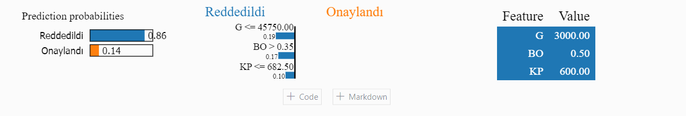
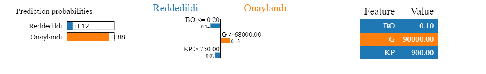

### Yapay Zeka ve XAI (Explainable Artificial Intelligence) Nedir ?

- Yapay zeka, bilgisayarların insanların yaptığı gibi düşünmesini sağlayan bir bilim dalıdır. Bildiğiniz üzere, Chat-GPT gibi araçların da çıkmasıyla yapay zeka hayatımıza iyice girmeye başladı. Biz farkında olsak da olmasak da her yerde bu araçları kullanıyoruz. Peki, siz hayatımızın her yerinde kullandığımız bu araçların nasıl çalıştığını merak ettiniz mi?

---

### XAI (Explainable Artificial Intelligence) Nedir?

- Açıklanabilir yapay zeka (XAI), yapay zeka sistemlerini daha "insan dostu" hale getirmeyi amaçlayan bir yaklaşımdır. Yapay zeka sistemlerinin nasıl kararlar verdiğini, hangi bilgileri kullanarak bu kararları aldığını ve neden belirli sonuçlara ulaştığını daha iyi anlayabiliriz. Bunu yapmak, özellikle hayati öneme sahip kararlar alındığında, güvenilirliği artırır ve insanların bu sistemlere daha fazla güven duymasına yardımcı olur. Başka bir deyişle, XAI, yapay zekanın "büyü gibi" görünmesini önler ve insanların bu teknolojiyi daha şeffaf ve anlaşılır bir şekilde kullanmasına yardımcı olur.

Sınıflandırma için basit bir örnek vermek gerekirse;

- Örneğin, siz bir bankada çalışıyorsunuz ve bu banka, kime kredi verip vermeme konusunda kararlar almak için basit makine öğrenimi modellerini kullanıyor olsun. Bir gün Anadolunun ücra bir küyünden gelmiş bir çiftçi kredi başvurusu yapıyor ve bu model çiftciye kredi verilmemesi gerektiğini söylüyor. Doğal olarak çiftçi, sizden bunun nedenini sorar. Malum, çiftçinin ekini var, ülkenin durumu belli :) nasıl açıklarsınız bu durumu oturup çiftçiye bu modelin arkasındaki matematiği anlatacak değilsiniz herhalde :) Adam demez mi, "Ya toprağım başlatma şimdi cebirinden ve kalkülüsünden bana nedenini söyle." Siz bu durumu çiftçiye nasıl açıklarsınız?

İşte bu gibi durumlar da XAI devreye giriyor ve modelin aldığı kararı açıklıyor.

---

### Peki, Bu Araçların Nasıl Çalıştığını Merak Ettiniz mi?

- Makine öğrenmesi modelleri, veri bilimcilerin ve mühendislerin birçok sorunu çözümünde kullandığı bir araçtır. Ancak bu modellerin çoğu, kararlarını açıklamak için tasarlanmamıştır. Bu nedenle, bu modellerin kararlarını açıklamak için XAI tekniklerine ihtiyaç duyulmaktadır.
- Bu araçların başında ise LIME (Local Interpretable Model-Agnostic Explanations) ve SHAP (SHapley Additive exPlanations) gelmektedir.
- Bu alanda Türkçe kaynak neredeyse yok, ben sadece İngilizce kaynaklardan ve bu kütüphanelerin GitHub'daki orijinal dokümantasyonlarından yararlanarak sizlere bu konuyu anlatmaya çalışacağım.
- İleriki zamanlarda bu iki araç dışında yeni çıkan araçları da inceleyip sizlerle paylaşacağım.

---

### Simdi bir Lime kodu gorelim

- Asagidaki kodda, LimeTabularExplainer sınıfını kullanarak bir Lime nesnesi oluşturuyoruz.
- Bu sınıfın içerisindeki LimeTabularExplainer fonksiyonuna training_data parametresi olarak X_train'i, feature_names parametresi olarak da X_train'in sütun isimlerini veriyoruz.
- Daha sonra, LimeTabularExplainer sınıfının içerisindeki explain_instance fonksiyonuna data_row parametresi olarak [80000, 800, 0.1] değerlerini, predict_fn parametresi olarak da model.predict_proba fonksiyonunu veriyoruz.
- Daha sonra, exp.show_in_notebook fonksiyonunu kullanarak Lime aracının çıktısını görebiliyoruz.

---

```python
import lime
from lime import lime_tabular

explainer = lime_tabular.LimeTabularExplainer(
    training_data=np.array(X),
    feature_names=['G', 'KP', 'BO'],
    class_names=['Reddedildi', 'Onaylandı'],
    mode='classification'
)
"""
    G = Gelir
    KP = Kredi Puanı
    BO = Borç Oranı
"""
exp = explainer.explain_instance(
    data_row=np.array([80000, 800, 0.1]),
    predict_fn=model.predict_proba
)

exp.show_in_notebook(show_table=True, show_all=False)
```

---


### Simdi gelin bu ciktiyi analiz edelim.

Öncelikle, bizim girdiğimiz örnek için (Gelir: 80.000, Kredi Puanı: 800, Borç Oranı: 0.1) modelimiz kredi başvurusunu 0.88 olasılıkla onaylayacağını söylüyor. LIME aracı ise bu kararın nasıl alındığını açıklıyor.
En solda çıktı olasılıklarını verir. %88 olasılıkla kredi başvurusu onaylanacak, %12 olasılıkla reddedilecek.
Ardından, bu çıktı olasılıklarının kolonlara olan etkilerini gösteriyor.
Örneğin; Bu müşteri için Gelir, kredi almasında pozitif etki ediyor, ancak Borç ve Kredi Puanının kredi almasında negatif etkisi var.

## Şimdi bunu test edelim, örneğin, gelir 68.500'den büyük olduğu durumlarda pozitif etki ediyor. O zaman, bu geliri düşürelim, bakalım ne olacak

---

```python
import lime
from lime import lime_tabular

explainer = lime_tabular.LimeTabularExplainer(
    training_data=np.array(X),
    feature_names=['G', 'KP', 'BO'],
    class_names=['Reddedildi', 'Onaylandı'],
    mode='classification'
)
"""
    G = Gelir
    KP = Kredi Puanı
    BO = Borç Oranı
"""
exp = explainer.explain_instance(
    data_row=np.array([40000, 800, 0.1]),
    predict_fn=model.predict_proba
)

exp.show_in_notebook(show_table=True, show_all=False)
```


Gördüğünüz gibi, gelir 68.500'den küçük olduğu durumda kredi başvurusu reddediliyor. Tabii ki, biz örnek olsun diye geliri çok düşürdük, ancak bu örnekle anladığımız şey gelirin kredi başvurusu onayı için önemli bir faktör olduğu.

Şimdi gelin, bizim bir çiftçimiz vardı ya, onun için de Lime aracını kullanalım.
Malum, ona kredi vermemiştik. :(

---

```python
import lime
from lime import lime_tabular

explainer = lime_tabular.LimeTabularExplainer(
    training_data=np.array(X),
    feature_names=['G', 'KP', 'BO'],
    class_names=['Reddedildi', 'Onaylandı'],
    mode='classification'
)
"""
    G = Gelir
    KP = Kredi Puanı
    BO = Borç Oranı
"""
exp = explainer.explain_instance(
    data_row=np.array([3000, 600, 0.5]),
    predict_fn=model.predict_proba
)

exp.show_in_notebook(show_table=True, show_all=False)
```



Görüleceği üzere, bu çiftçi için kredi başvurusu reddedildi, çünkü geliri düşük, kredi puanı düşük ve borç oranı yüksek. Bu durumda, çiftçiye kredi vermediğimiz için haklı çıkmışız. :)
Çiftci sorunu sormuştu ya, biz de cevabını verdik. :) Şimdi çiftçi gitti, gelirini ve kredi puanını yükseltti, borç oranını düşürdü. Bakalım ne olacak?

```python
import lime
from lime import lime_tabular

explainer = lime_tabular.LimeTabularExplainer(
    training_data=np.array(X),
    feature_names=['G', 'KP', 'BO'],
    class_names=['Reddedildi', 'Onaylandı'],
    mode='classification'
)
"""
    G = Gelir
    KP = Kredi Puanı
    BO = Borç Oranı
"""
exp = explainer.explain_instance(
    data_row=np.array([90000, 900, 0.1]),
    predict_fn=model.predict_proba
)

exp.show_in_notebook(show_table=True, show_all=False)

```


Banka soydu herhalde :) bir anda geliri bu kadar artti. Görüleceği üzere, çiftçi kredi aldı. :)
Ayrıca şunuda unutmamak gerekirki çıktısı her veri örneği için varklı olması gayet normaldir sonuçta kimisinin geliri yüksektir ama borç oarnı yüksektir kimisinin geliri düşüktür ama borç oranı düşüktür. Bu yüzden çıktılar farklı olacaktır.
s
