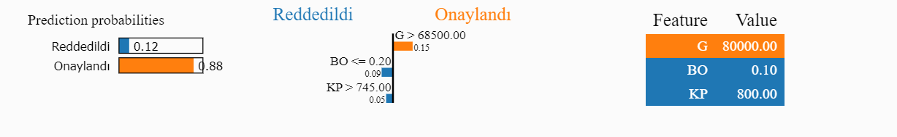

### Yapay Zeka ve XAI (Explainable Artificial Intelligence) Nedir?

- Yapay zeka, bilgisayarların insanların yaptığı gibi düşünmesini sağlayan bir bilim dalıdır. Bildiğiniz üzere, Chat-GPT gibi araçların da çıkmasıyla yapay zeka hayatımıza iyice girmeye başladı. Biz farkında olsak da olmasak da her yerde bu araçları kullanıyoruz. Peki, siz hayatımızın her yerinde kullandığımız bu araçların nasıl çalıştığını merak ettiniz mi?

---

### XAI (Explainable Artificial Intelligence) Nedir?

- Açıklanabilir yapay zeka (XAI), yapay zeka sistemlerini daha "insan dostu" hale getirmeyi amaçlayan bir yaklaşımdır. Yapay zeka sistemlerinin nasıl kararlar verdiğini, hangi bilgileri kullanarak bu kararları aldığını ve neden belirli sonuçlara ulaştığını daha iyi anlayabiliriz. Bunu yapmak, özellikle hayati öneme sahip kararlar alındığında, güvenilirliği artırır ve insanların bu sistemlere daha fazla güven duymasına yardımcı olur. Başka bir deyişle, XAI, yapay zekanın "büyü gibi" görünmesini önler ve insanların bu teknolojiyi daha şeffaf ve anlaşılır bir şekilde kullanmasına yardımcı olur.

Basit bir örnek vermek gerekirse;

- Günümüzde bazı şirketler artık yüzlerce iş başvurusu için tek tek CV'leri incelemek yerine yapay zeka araçlarıyla CV'leri analiz ediyorlar ve sizin bu iş pozisyonuna uygun olup olmadığınızı belirliyorlar.
  Ancak, bu araçların çoğu kararlarını açıklamak için tasarlanmamıştır. Bu nedenle, bu araçların kararlarını açıklamak için Açıklanabilir Yapay Zeka (XAI) tekniklerine ihtiyaç duyulmaktadır. Neden mi? Çünkü düşünün ki bir şirkete başvuru yaptınız, CV'niz incelendi, ancak neden uygun olmadığınızı bilmiyorsunuz. Bu durumda sizin için bir haksızlık olduğunu düşünmez misiniz?
  Ya da şirket size doğrudan "Bizim yapay zeka modelimiz sizi uygun bulmadı" derse, bu oldukça absürt olmaz mı?
  Siz de demez misiniz, neden beni uygun bulmadı diye?
  İşte bu durumda XAI teknikleri devreye giriyor ve sizin neden uygun olmadığınızı açıklıyor.

Bir örnek daha vermek gerekirse;

- Örneğin, bir banka hangi müşteriye kredi verip vermeyeceğine karar vermek için yapay zeka araçları kullanıyor olsun.
  Siz de bu bankaya kredi başvurusu yaptınız ve elbette ki ülkenin ekonomik durumu göz önünde bulundurulduğunda ciddi bir ihtiyacınız var.
  Banka, kredi başvurunuzu yapay zeka araçlarıyla değerlendiriyor ve sizin krediye uygun olmadığınıza karar veriyor.
  Siz, Anadolu köyünden gelmiş, sıkıntılı bir dönemde bulunan birisiniz ve bu yapay zeka ya da model nedir, neden size kredi vermiyor diye düşünüyorsunuz.
  Diyelim ki o bankada çalışan bir memursunuz ve bu durumu nasıl açıklarsınız?
  İşte bu durumda XAI teknikleri devreye giriyor ve sizin neden uygun olmadığınızı açıklıyor. Siz de bu durumu çiftçiye anlatıyorsunuz ve çiftçi, neden krediye uygun olmadığını kabul ediyor.

---

### Peki bu araclarin nasil calistigini merak ettiniz mi?

- Yapay zeka ve makine ogrenmesi modellerinin nasil calistigini merak edenler icin XAI (Explainable Artificial Intelligence) yani aciklanabilir yapay zeka kavrami ortaya cikti.
- Makine öğrenmesi modelleri, veri bilimcilerin ve mühendislerin birçok sorunun çözümünde kullandığı bir araçtır. Ancak bu modellerin çoğu, kararlarını açıklamak için tasarlanmamıştır. Bu nedenle, bu modellerin kararlarını açıklamak için XAI tekniklerine ihtiyaç duyulmaktadır.
- Bu aralclarin basinda ise LIME( Local Interpretable Model-Agnostic Explanations) ve SHAP (SHapley Additive exPlanations) gelmektedir.
- Bu iki arac ile yapay zeka modellerinin kararlarini aciklayabiliriz.
- Bu alanda turkce kaynak nerdeyse yok ben sadece ingilizce kaynaklardan ve bu kutuphanelerin github daki orjinal dokumantasyonlarindan yararlanarak sizlere bu konuyu anlatmaya calisacagim.
- Ilerki zamanlarda bu iki arac disinda yeni cikan araclarida inceleyip sizlerle paylasacagim.

---

```python
import lime
from lime import lime_tabular

explainer = lime_tabular.LimeTabularExplainer(
    training_data=np.array(X_train),
    feature_names=['G', 'KP', 'BO'],
    class_names=['Reddedildi', 'Onaylandı'],
    mode='classification'
)
"""
    G = Gelir
    KP = Kredi Puanı
    BO = Borç Oranı
"""
exp = explainer.explain_instance(
    data_row=X_test[0],
    predict_fn=model.predict_proba
)

exp.show_in_notebook(show_table=True, show_all=False)
```



---

```python
import lime
from lime import lime_tabular

explainer = lime_tabular.LimeTabularExplainer(
    training_data=np.array(X_train),
    feature_names=['G', 'KP', 'BO'],
    class_names=['Reddedildi', 'Onaylandı'],
    mode='classification'
)
"""
    G = Gelir
    KP = Kredi Puanı
    BO = Borç Oranı
"""
exp = explainer.explain_instance(
    data_row=X_test[1],
    predict_fn=model.predict_proba
)

exp.show_in_notebook(show_table=True, show_all=False)
```


